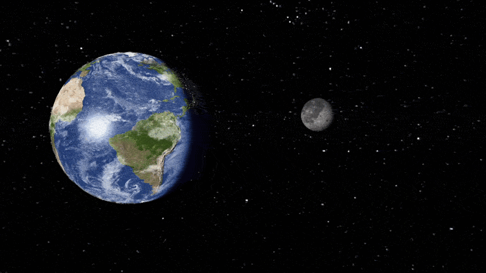

# OpenGL Space Cinematic

Real-time OpenGL project featuring a cinematic journey from an Earth under
meteor bombardment to a wide shot of the Solar System and the Milky Way.



## Overview

This project combines a scripted camera sequence with real-time rendering and
simulation. It demonstrates a complete OpenGL scene rather than a collection
of isolated effects:

- Earth lighting with day/night, normal, specular, damage and heat maps.
- Deterministic meteor showers, collisions, trails and impact effects.
- Progressive crust damage, cracks and a 32-piece Earth breakup.
- HDR rendering, bloom, emissive materials and impact lights.
- A shuttle flight followed by a Solar System and Milky Way reveal.
- Music and impact sounds synchronized with the cinematic timeline.
- A free FPS camera for exploring the scene while the sequence continues.

## Features

### Cinematic sequence

The main sequence lasts approximately 110 seconds. It starts with an intact
Earth, builds through several meteor waves, triggers the destruction sequence,
then pulls back from the shuttle to the Solar System and the galaxy.

### Meteor simulation

Meteors are generated on the CPU with reproducible random seeds. Their
continuous collision detection prevents tunneling at high speed. Impacts feed
the damage, heat, particle, light and audio systems independently.

### Earth destruction

Impact energy accumulates into a global destruction level. The surface develops
burn marks, temporary heat and procedural cracks before the Earth separates into
animated fragments around an emissive core.

### Rendering

The renderer uses shared meshes and materials, instanced particles, textured
planets, transparent Saturn rings and an HDR pipeline with bloom. The design
keeps simulation, scene management and rendering in separate modules.

### Audio

The cinematic music drives the visible timeline when it is available. FFmpeg
converts the supplied MP3 files to WAV during the build, while SDL3 handles
playback, volume, mute and impact sounds.

## Desktop support and downloadable packages

The desktop targets are **Windows x64, macOS Apple Silicon / Intel, and Linux
x64 / ARM64**. Each platform has its own executable; one binary cannot run on
all operating systems. A graphics driver supporting OpenGL 3.3 is required.

Download the matching `package-*` artifact from a successful run in
[GitHub Actions](https://github.com/Hicha-m/project-opengl/actions). Extract the
complete archive, then launch `project.exe` on Windows, `project.app` on macOS,
or `project` on Linux. Keep the resources and bundled libraries together.
You can move the extracted directory and launch it from another working directory,
including paths containing spaces and non-ASCII characters.

Packages contain converted WAV audio; **FFmpeg is needed only when building**.
SDL3 handles music and impact playback through the host's default audio device.
The application reports unavailable audio and can continue without sound.
Do not set `SDL_AUDIO_DRIVER=dummy` when you want audible playback.

macOS packages are ad-hoc signed, not Apple-notarized. Linux packages include
SDL3, GLFW; system libraries and graphics drivers come from the host.
The CI packages target the runner's operating system baseline, rather than every
historical OS release. Rebuild from source for a different Linux baseline.

## Requirements for building

- C++17 compiler and CMake 3.21+ (GNU Make is also available on Linux).
- OpenGL, GLFW 3.3+, GLM and SDL3 3.2+ development packages.
- FFmpeg on `PATH` to convert the supplied MP3 files.
- `stb_image` and the GLAD OpenGL loader are included in `third_party/`.

### Linux and macOS (CMake)

On Fedora:

```bash
sudo dnf install gcc-c++ cmake make glfw-devel glm-devel SDL3-devel ffmpeg
```

On macOS:

```bash
brew install cmake glfw glm sdl3 ffmpeg
```

Ubuntu 24.04 requires SDL3 to be built from source; the Dockerfile and GitHub
workflow handle this automatically. CMake uses the libraries' CMake packages;
the GNU Make build uses `pkg-config`.

Run from the project directory:

```bash
cmake -S . -B build/cmake -DCMAKE_BUILD_TYPE=Release
cmake --build build/cmake --parallel 2
ctest --test-dir build/cmake -L unit --output-on-failure
cmake --build build/cmake --target run
```

### Windows (Visual Studio and vcpkg)

Install Visual Studio 2022 with the Desktop development with C++ workload,
CMake, Git, FFmpeg and [vcpkg](https://learn.microsoft.com/vcpkg/get_started/get-started).
Set `VCPKG_ROOT` to your vcpkg checkout. The repository's `vcpkg.json` pins the
library versions through a baseline. Run in PowerShell from the project directory:

```powershell
cmake -S . -B build/cmake -A x64 `
  "-DCMAKE_TOOLCHAIN_FILE=$env:VCPKG_ROOT/scripts/buildsystems/vcpkg.cmake" `
  -DVCPKG_TARGET_TRIPLET=x64-windows-static `
  '-DCMAKE_MSVC_RUNTIME_LIBRARY=MultiThreaded$<$<CONFIG:Debug>:Debug>'
cmake --build build/cmake --config Release --parallel 2
ctest --test-dir build/cmake -C Release -L unit --output-on-failure
cmake --build build/cmake --config Release --target run
```

This configuration links the libraries and MSVC runtime statically. You can also
use shared libraries; CMake includes their runtime dependencies during packaging.

### Packaging and graphical validation

After building:

```bash
cpack --config build/cmake/CPackConfig.cmake -C Release -B build/packages
```

This creates a ZIP on Windows/macOS or a compressed tar archive on Linux.
The macOS `.app` includes its resources and bundled dylibs with rewritten paths.
You can also stage an installation with
`cmake --install build/cmake --config Release --prefix /path/to/installation`.
Use `-DBUNDLE_RUNTIME_DEPENDENCIES=OFF` only if the destination provides the libraries.

To enable the complete OpenGL integration test on Linux:

```bash
cmake -S . -B build/cmake -DENABLE_RUNTIME_TESTS=ON
cmake --build build/cmake --parallel 2
LIBGL_ALWAYS_SOFTWARE=1 xvfb-run -a ctest --test-dir build/cmake -L runtime --output-on-failure
```

`project --smoke-test` creates a hidden window, loads the complete scene, verifies
music and impact audio initialization, and renders three frames. Set
`SDL_AUDIO_DRIVER=dummy` for automated testing. This verifies the playback code;
it cannot confirm what a user hears from a physical speaker.
`--smoke-test --software-context` uses GLFW 3.4+ and an installed OSMesa library
for graphical verification on machines without a display or native GPU.

### GNU Make

Run these commands from the project directory:

```bash
make              # Build the application
make run          # Build and launch the cinematic
make test         # Run CPU and audio tests
make test-runtime # Run the hidden-window OpenGL test suite
make clean        # Remove build files and generated executables
```

`make test-runtime` needs a working X11 display even though the test window is
hidden. The build generates converted audio files in `build/music/`; the
original MP3 files remain unchanged.

## MP4 export

Build the application, then run the exporter with Python 3 and FFmpeg on `PATH`:

```bash
python3 tools/export_mp4.py
python3 tools/export_mp4.py --resolution 1080p --fps 60 --crf 18 --preset slow --output exports/film-1080p.mp4
python3 tools/export_mp4.py --resolution 4k --fps 30 --output exports/film-4k.mp4
python3 tools/export_mp4.py --resolution 640x360 --duration 5 --output exports/preview.mp4
```

On Windows, use `python` instead of `python3` if necessary.
The default export is `exports/cinematic.mp4`, at 1280×720 and 30 fps, with
H.264 video and AAC audio. It includes the complete music and meteor impact
sounds with distance attenuation. Frames are simulated at fixed time steps,
so rendering speed does not alter the film's playback speed or audio timing.
The renderer captures the HDR/bloom result before swapping buffers.

| Option | Choices / effect |
| --- | --- |
| `--resolution` | `720p`, `1080p`, `1440p`, `4k`, or even pixel dimensions such as `1920x1080` |
| `--fps` | 1–240; default 30, typically 30 or 60 |
| `--crf` | 0–51; lower means better quality and larger files; default 18 |
| `--preset` | `ultrafast` through `veryslow`; default `medium`; slower encoding generally makes smaller files |
| `--duration` | Render the first N seconds; default is the music duration |
| `--no-audio` | Omit music and impacts |
| `--output` | Destination `.mp4`; existing files are preserved |
| `--executable` | Explicit executable path for another build or downloaded package |
| `--software-context` | Headless OSMesa rendering with GLFW 3.4+ and OSMesa installed |

A working OpenGL context is required. Normal exports use a hidden desktop window;
on Linux without a display, use Xvfb or the OSMesa option. Higher resolutions and
frame rates increase rendering time. Export uses a compressed temporary video
and a temporary audio mix, which are removed on completion or failure.
The options are command-line settings; there is no graphical export dialog.

## Docker

Build a Linux image from the project directory:

```bash
docker build -t project-opengl .
```

The multi-stage build compiles SDL3 3.2.10 and the application, runs all CPU,
audio and OpenGL tests under Xvfb, then keeps only the application, assets and
runtime libraries in the final image.

To open the application on a Linux X11 desktop (including XWayland), pass the
display socket and your X11 authorization file:

```bash
docker run --rm \
  --user "$(id -u):$(id -g)" \
  -e DISPLAY \
  -e XAUTHORITY=/tmp/container.xauth \
  -e LIBGL_ALWAYS_SOFTWARE=1 \
  -e SDL_AUDIO_DRIVER=dummy \
  -v /tmp/.X11-unix:/tmp/.X11-unix:ro \
  -v "${XAUTHORITY:-$HOME/.Xauthority}:/tmp/container.xauth:ro" \
  project-opengl
```

The Xauthority file must exist and authorize the current display. This command
uses software rendering and silent audio; desktop audio/GPU forwarding depends
on the host configuration. The native CMake build provides normal desktop audio.
The container desktop launch is intended for Linux hosts.

## GitHub Actions (CI/CD)

[The workflow](.github/workflows/cmake-multi-platform.yml) runs on default-branch pushes,
pull requests and manual triggers:

- Debug and Release builds with Clang on Linux and macOS Apple Silicon, plus
  Linux GCC, Linux ARM64, macOS Intel and Windows MSVC builds.
- Fourteen CPU/audio/resource tests, including executable-relative loading
  and WAV playback from Unicode paths.
- The complete OpenGL integration suite on Linux with Xvfb and Mesa.
- Package extraction and scene/audio/rendering startup on every desktop target
  from an unrelated working directory and a Unicode installation path. macOS
  runners lack a suitable native OpenGL GPU, so their rendering test uses an
  explicit headless OSMesa context. Normal macOS launches use Cocoa/OpenGL.
- Windows CI uses a checksum-verified Mesa software renderer for its startup
  test; it is not included in the distributed application.
- Verified Release packages are uploaded as downloadable artifacts.
- Docker builds only after the desktop checks succeed. Default-branch pushes
  also publish `ghcr.io/hicha-m/project-opengl:latest` and `sha-<commit>`.

## Mobile scope

The current application is a desktop OpenGL/GLFW application. It does not produce
an Android APK or an iOS app. SDL3 audio can be reused for those platforms, but
mobile support requires replacing GLFW's window/input loop, adapting the shaders
and renderer to OpenGL ES or a supported mobile graphics backend, packaging
resources for mobile storage, and implementing touch controls. Desktop packages
must not be presented as mobile builds. See [the mobile assessment](docs/MOBILE.md).

## Controls

| Key | Action |
| --- | --- |
| `Space` | Pause or resume the sequence and music |
| `R` | Restart the complete cinematic |
| `Left` / `Right` | Seek backward or forward by 10 seconds |
| `Up` / `+` | Double playback speed, up to 8x |
| `Down` / `-` | Halve playback speed, down to 0.25x |
| `0` | Restore normal speed |
| `M` | Mute or unmute audio |
| `F3` | Switch between cinematic and FPS camera |
| `F11` | Toggle fullscreen and restore the previous window size and position |
| `W` / `S` | Move forward or backward in FPS mode |
| `A` / `D` | Strafe left or right in FPS mode |
| `Z` / `X` | Move up or down in FPS mode |
| Mouse | Look around in FPS mode |
| `G` / `H` | Increase or decrease FPS movement speed |
| `F1` | Toggle wireframe rendering |
| `F2` | Toggle camera information |
| `Esc` | Quit |

## Project structure

```text
src/
├── Application.cpp       Application loop, input and system orchestration
├── animation/            Timeline, keyframes and animation tracks
├── audio/                SDL3 music and impact playback
├── camera/               FPS, orbit and cinematic cameras
├── cinematic/            Main film sequence and scene choreography
├── geometry/             Sphere generation and collision geometry
├── graphics/             Meshes, shaders, textures, HDR and particles
├── scene/                Objects, materials, lights and scene setup
└── systems/              Meteors, solar system, damage, breakup and particles

shaders/                  GLSL vertex and fragment shaders
textures/                 Planet, space and effect textures
models/                   Shuttle model and material data
audio/                    Music and impact sound sources
tests/                    CPU, audio and OpenGL integration tests
```

## Testing

The test suite covers deterministic replay, animation, orbital motion, meteor
spawning and collision, particle and trail emission, impact lights, Earth
damage and heat, destruction level, breakup state and audio behavior.

The runtime tests also exercise OpenGL resource loading, HDR/bloom rendering,
occlusion, particle instancing, reset behavior and full-sequence replay.
Generated diagnostic captures are written to `/tmp` by the runtime tests.

## Assets

The project uses the supplied textures, shuttle model and audio files. Paths
are resolved relative to the project root, so launch the application with
`make run` or from this directory:

```bash
./project
```

## License

No license has been specified for this project yet.
